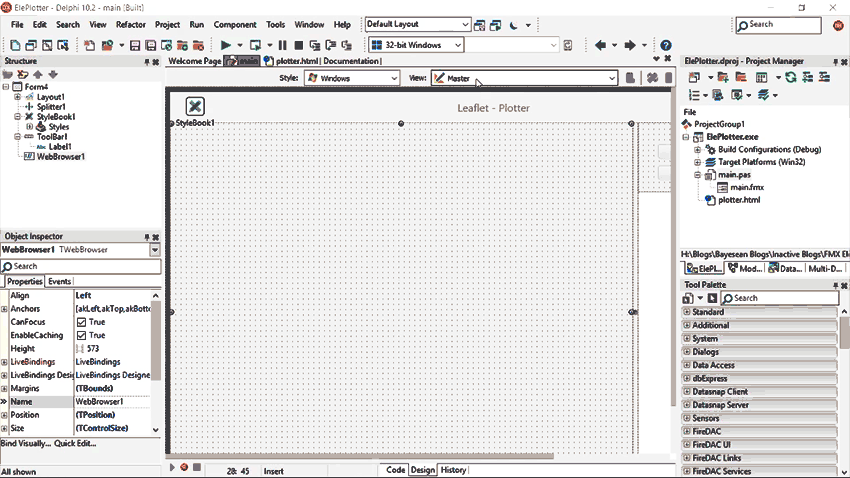
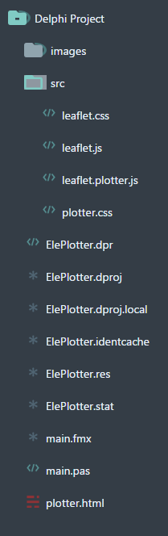

**Delphi FMX Leaflet Plotter using OSM Maps**

By making use of the Leaflet Plotter open source JavaScript libraries, all the
processing is performed in the browser without having to create an extra Delphi
layer to code and perform these functions.

**Components used**

-   **Delphi FMX standard components**:- Toolbar, Browser, buttons and memo.
    This could easily be used in a VCL application.

-   [Leaflet.js](https://leafletjs.com) is a mature open-source mapping
    JavaScript library which has a huge following with all sorts of open-source
    supporting libraries that will provide a solution for any type of mapping
    requirement.

-   [Leaflet plotter](https://github.com/scripter-co/leaflet-plotter) is found
    in **Github** is just one of these add-on libraries which allows plotting
    onto a leaflet map.

-   [Scriptgate](https://bitbucket.org/freeonterminate/scriptgate) is a
    fantastic call-back light-weight library that allows Delphi to communicate
    with the Browser by overcoming the CORS restriction in the cross platform
    browser component. First install the component through the *Gettit Manager*
    and only then can you compile the example.

**Code**

Feel free to download the code.

**Running the Project**

Ensure that you have connection to the Internet before running the Application
as it needs to call the OSM Maps to download the correct tile(s) to be viewed in
the browser.

The plotting is essential a new map overlay. A left click will add a plotted
point and update the plotted points list. This point can be repositioned with
left mouse-down and dragged.

Double clicking the point will delete the point and update the internal plotted
points list.

**Licence MIT.**

**Blog**

**Read the Blog:-**
[https://www.Bayeseanblog.com](https://www.bayeseanblog.com/) to understand how
the code works.

Happy Coding
